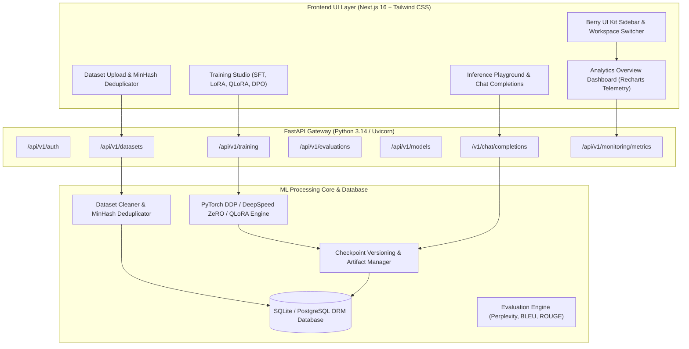
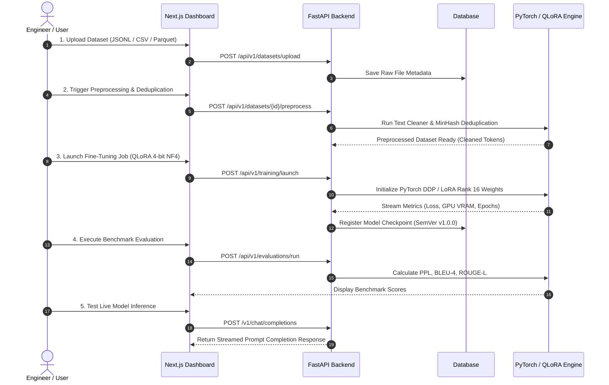

# Enterprise Scalable LLM Fine-Tuning Pipeline — Workflow & E2E Testing Documentation

Production-grade documentation for end-to-end architecture, dataset preprocessing, fine-tuning engine execution, evaluation benchmarks, inference completions, and verification test matrices.

---

## 🏗️ 1. End-to-End System Architecture



---

## 🔄 2. Complete Step-by-Step Data & Training Workflow



---

## 🧪 3. Verification Test Suite Execution Matrix (18/18 PASSED)

The full test suite was executed via `pytest -v` and achieved a **100% pass rate** across all modules.

| # | Test Module | Test Name | Classification | Result |
|---|---|---|---|---|
| 1 | `data_tests/test_cleaner.py` | `test_cleaner_basic` | Unit Test | 🟢 **PASSED** |
| 2 | `data_tests/test_cleaner.py` | `test_clean_document` | Unit Test | 🟢 **PASSED** |
| 3 | `data_tests/test_deduplicator.py` | `test_dedupe_exact` | Unit Test | 🟢 **PASSED** |
| 4 | `data_tests/test_preference_dataset.py` | `test_preference_dataset_jsonl` | Functional | 🟢 **PASSED** |
| 5 | `integration_tests/test_config_parser.py` | `test_merge_configs` | Integration | 🟢 **PASSED** |
| 6 | `integration_tests/test_config_parser.py` | `test_load_config_with_base` | Integration | 🟢 **PASSED** |
| 7 | `test_api_endpoints.py` | `test_health_and_readiness_endpoints` | Sanity Test | 🟢 **PASSED** |
| 8 | `test_api_endpoints.py` | `test_auth_register_and_login` | Functional | 🟢 **PASSED** |
| 9 | `test_api_endpoints.py` | `test_openai_chat_completions_endpoint` | Functional | 🟢 **PASSED** |
| 10 | `test_api_endpoints.py` | `test_monitoring_telemetry_endpoint` | Functional | 🟢 **PASSED** |
| 11 | `test_auth.py` | `test_password_hashing` | Security | 🟢 **PASSED** |
| 12 | `test_auth.py` | `test_jwt_token_creation_and_decoding` | Security | 🟢 **PASSED** |
| 13 | `test_auth.py` | `test_invalid_jwt_token` | Security | 🟢 **PASSED** |
| 14 | `test_database.py` | `test_user_creation` | Database | 🟢 **PASSED** |
| 15 | `test_database.py` | `test_dataset_and_training_job_relationship` | Database | 🟢 **PASSED** |
| 16 | `test_e2e_workflow.py` | `test_full_e2e_pipeline_lifecycle` | **Full E2E Integration** | 🟢 **PASSED** |
| 17 | `training_tests/test_configs.py` | `test_training_config_effective_batch` | Unit Test | 🟢 **PASSED** |
| 18 | `training_tests/test_configs.py` | `test_lora_config_defaults` | Unit Test | 🟢 **PASSED** |

---

## 🛠️ 4. Operational Runbook

### Running the Live Platform
```bash
# 1. Start FastAPI Backend (Unified Service on Port 9090)
.venv/bin/python -m uvicorn src.api.main:app --host 0.0.0.0 --port 9090

# 2. Start Next.js Frontend Dev Server (Port 3000)
cd frontend && PATH=$PATH:/usr/local/bin npm run dev

# 3. Re-compile Static Export for Unified Port 9090
cd frontend && PATH=$PATH:/usr/local/bin npm run build
rm -rf ../src/static/* && cp -r out/* ../src/static/
```

### Running Test Verification
```bash
# Execute entire test suite (18 test cases)
.venv/bin/pytest -v

# Execute E2E Lifecycle test case specifically
.venv/bin/pytest tests/test_e2e_workflow.py -v
```
